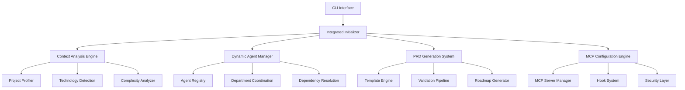
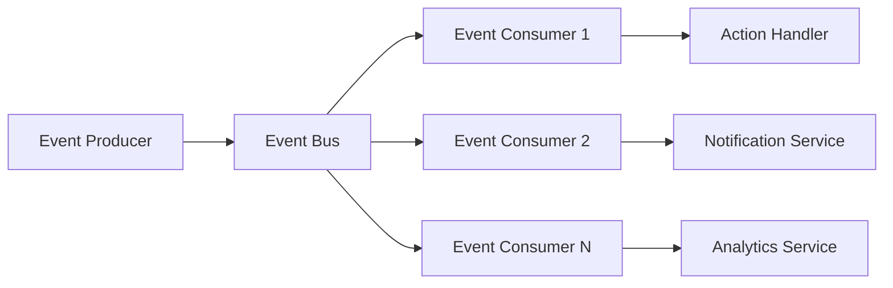

# BMAD Studio Template - System Architecture Documentation

## Executive Summary

BMAD Studio Template is an enterprise-ready intelligent project initialization framework that combines adaptive project setup, advanced agent orchestration, and comprehensive workflow automation. This document outlines the improved system architecture based on comprehensive analysis and recommendations.

## 1. System Architecture Overview

### 1.1 High-Level Architecture



### 1.2 Core Design Principles

- **Modularity**: Clear separation of concerns with well-defined interfaces
- **Scalability**: Horizontal scaling support with microservices architecture
- **Security**: Multi-layered security with sandboxed execution
- **Adaptability**: Context-aware configuration and intelligent defaults
- **Observability**: Comprehensive monitoring and logging
- **Extensibility**: Plugin-based architecture for custom extensions

## 2. Component Architecture

### 2.1 Context Analysis Engine

**Purpose**: Intelligent project context detection and profiling

**Components**:
- `ProjectProfiler`: Analyzes project requirements and generates profiles
- `TechnologyDetector`: Automatic stack detection using NLP and patterns
- `ComplexityAnalyzer`: Evaluates project complexity using multiple criteria
- `DomainClassifier`: Identifies project domain (marketplace, SaaS, mobile, etc.)

**Architecture Pattern**: Strategy Pattern with Context-aware selection

```typescript
interface ContextAnalyzer {
  analyze(input: ProjectInput): Promise<ProjectContext>
  getConfidence(): number
  getRecommendations(): Recommendation[]
}

class ProjectProfiler implements ContextAnalyzer {
  private detectors: TechnologyDetector[]
  private analyzers: ComplexityAnalyzer[]
  private classifiers: DomainClassifier[]
}
```

### 2.2 Dynamic Agent Management System

**Purpose**: Intelligent agent selection, configuration, and orchestration

**Components**:
- `AgentRegistry`: Centralized agent definitions with metadata
- `DepartmentCoordinator`: Inter-departmental workflow coordination
- `DependencyResolver`: Agent dependency resolution with conflict detection
- `ConfigurationCache`: Performance-optimized configuration caching

**Architecture Pattern**: Registry + Dependency Injection + Observer

```typescript
interface Agent {
  id: string
  department: Department
  capabilities: Capability[]
  dependencies: AgentDependency[]
  execute(context: ExecutionContext): Promise<Result>
}

class DynamicAgentManager {
  private registry: AgentRegistry
  private coordinator: DepartmentCoordinator
  private resolver: DependencyResolver
  private cache: ConfigurationCache
}
```

### 2.3 PRD Generation System

**Purpose**: Automated Product Requirements Document generation with validation

**Components**:
- `TemplateEngine`: Context-aware template selection and processing
- `ValidationPipeline`: Multi-stage PRD quality validation
- `RoadmapGenerator`: Agile roadmap and sprint planning automation
- `IntegrationConnector`: Direct integration with project management tools

**Architecture Pattern**: Pipeline + Template Method + Strategy

```typescript
interface PRDGenerator {
  generate(context: ProjectContext): Promise<PRD>
  validate(prd: PRD): ValidationResult
  export(prd: PRD, format: ExportFormat): Promise<string>
}

class EnhancedPRDGenerator implements PRDGenerator {
  private templateEngine: TemplateEngine
  private validator: ValidationPipeline
  private roadmapGen: RoadmapGenerator
}
```

### 2.4 MCP Configuration Engine

**Purpose**: Model Context Protocol configuration with enterprise-grade security

**Components**:
- `MCPServerManager`: Microservices-based MCP server orchestration
- `SecurityValidator`: Multi-layered security validation and sandboxing
- `HookOrchestrator`: Advanced hook system with marketplace specializations
- `MonitoringService`: Comprehensive observability and performance tracking

**Architecture Pattern**: Microservices + Event-driven + Observer

```typescript
interface MCPService {
  id: string
  version: string
  capabilities: Capability[]
  security: SecurityProfile
  start(): Promise<void>
  stop(): Promise<void>
  health(): HealthStatus
}

class MCPConfigEngine {
  private serverManager: MCPServerManager
  private securityValidator: SecurityValidator
  private hookOrchestrator: HookOrchestrator
  private monitor: MonitoringService
}
```

## 3. Security Architecture

### 3.1 Multi-Layer Security Model

```
┌─────────────────────────────────────┐
│           Application Layer          │
├─────────────────────────────────────┤
│          Authentication             │
├─────────────────────────────────────┤
│          Authorization              │
├─────────────────────────────────────┤
│         Validation Layer            │
├─────────────────────────────────────┤
│         Sandbox Execution           │
├─────────────────────────────────────┤
│         Encryption Layer            │
├─────────────────────────────────────┤
│         Audit & Logging             │
└─────────────────────────────────────┘
```

### 3.2 Security Components

- **InputValidator**: Comprehensive input sanitization and validation
- **SandboxManager**: Isolated execution environment for hooks and MCP servers
- **EncryptionService**: Enterprise-grade encryption for sensitive data
- **AuditLogger**: Complete audit trail with immutable logging
- **ThreatDetector**: Real-time threat detection and response

## 4. Performance Architecture

### 4.1 Caching Strategy

```
┌─────────────────┐    ┌─────────────────┐    ┌─────────────────┐
│   L1 Cache      │    │   L2 Cache      │    │   L3 Cache      │
│   (Memory)      │    │   (Redis)       │    │   (Persistent)  │
│   - Configs     │    │   - Templates   │    │   - Artifacts   │
│   - Agents      │    │   - Profiles    │    │   - Histories   │
│   - Context     │    │   - Workflows   │    │   - Analytics   │
└─────────────────┘    └─────────────────┘    └─────────────────┘
```

### 4.2 Optimization Techniques

- **Lazy Loading**: Resources loaded only when needed
- **Parallel Processing**: Concurrent execution for independent operations  
- **Connection Pooling**: Efficient resource management
- **Compression**: Data compression for large payloads
- **CDN Integration**: Static asset delivery optimization

## 5. Data Flow Architecture

### 5.1 Request Processing Pipeline

```
User Input → Context Analysis → Agent Selection → Configuration Generation → 
Project Setup → MCP Integration → Validation → Final Output
```

### 5.2 Event-Driven Architecture



## 6. Integration Architecture

### 6.1 External Integrations

- **Claude Code**: Native MCP integration with project.mcp.json
- **Development Tools**: IDE plugins and extensions
- **Project Management**: Jira, Azure DevOps, Linear, Asana
- **Cloud Platforms**: AWS, Azure, GCP deployment automation
- **Monitoring**: ELK Stack, Prometheus, Grafana, Jaeger

### 6.2 API Architecture

**RESTful APIs**:
- `/api/v1/projects` - Project management endpoints
- `/api/v1/agents` - Agent configuration endpoints
- `/api/v1/templates` - Template management endpoints
- `/api/v1/workflows` - Workflow orchestration endpoints

**WebSocket APIs**:
- Real-time progress updates
- Agent communication channels
- Live configuration validation

## 7. Deployment Architecture

### 7.1 Container Architecture

```dockerfile
# Multi-stage build for optimization
FROM node:18-alpine AS builder
FROM node:18-alpine AS runtime

# Security-hardened configuration
RUN addgroup -g 1001 -S bmad
RUN adduser -S bmad -u 1001
USER bmad

EXPOSE 3000
HEALTHCHECK --interval=30s CMD node health-check.js
```

### 7.2 Orchestration with Kubernetes

```yaml
apiVersion: apps/v1
kind: Deployment
metadata:
  name: bmad-studio-template
spec:
  replicas: 3
  selector:
    matchLabels:
      app: bmad-studio-template
  template:
    spec:
      containers:
      - name: bmad-core
        image: bmad-studio:latest
        resources:
          requests:
            memory: "256Mi"
            cpu: "250m"
          limits:
            memory: "512Mi"
            cpu: "500m"
```

## 8. Monitoring and Observability

### 8.1 Metrics Collection

- **Business Metrics**: Project creation rate, success rate, user satisfaction
- **Technical Metrics**: Response time, throughput, error rate, resource utilization
- **Security Metrics**: Authentication failures, security violations, audit events

### 8.2 Logging Strategy

```typescript
interface LogEntry {
  timestamp: Date
  level: LogLevel
  service: string
  traceId: string
  userId?: string
  message: string
  metadata?: Record<string, any>
}

class StructuredLogger {
  info(message: string, metadata?: Record<string, any>): void
  warn(message: string, metadata?: Record<string, any>): void  
  error(error: Error, metadata?: Record<string, any>): void
}
```

## 9. Disaster Recovery and Business Continuity

### 9.1 Backup Strategy

- **Configuration Backups**: Daily automated backups of all configurations
- **State Snapshots**: Point-in-time recovery capabilities
- **Cross-Region Replication**: Geographic distribution for disaster recovery

### 9.2 High Availability

- **Load Balancing**: Multiple instance deployment with load balancers
- **Circuit Breakers**: Automatic failover mechanisms  
- **Health Checks**: Continuous health monitoring with automatic remediation

## 10. Future Architecture Considerations

### 10.1 Scalability Enhancements

- **Microservices Decomposition**: Further service breakdown for independent scaling
- **Event Sourcing**: Complete audit trail with event replay capabilities
- **CQRS**: Command Query Responsibility Segregation for performance

### 10.2 AI/ML Integration

- **Intelligent Agent Selection**: Machine learning for optimal agent recommendation
- **Predictive Analytics**: Project success prediction based on historical data
- **Natural Language Processing**: Advanced requirements extraction from conversations

## 11. Architectural Decision Records (ADRs)

### ADR-001: Adopt Microservices Architecture for MCP Services
**Status**: Accepted  
**Context**: Need for scalable, maintainable MCP service management  
**Decision**: Implement containerized microservices for MCP components  
**Consequences**: Increased complexity but improved scalability and maintainability

### ADR-002: Implement Event-Driven Architecture
**Status**: Accepted  
**Context**: Need for loose coupling between components  
**Decision**: Use event bus for inter-component communication  
**Consequences**: Better decoupling but increased complexity in debugging

### ADR-003: Multi-Layer Caching Strategy
**Status**: Accepted  
**Context**: Performance optimization requirements  
**Decision**: Implement L1 (memory), L2 (Redis), L3 (persistent) caching  
**Consequences**: Improved performance but increased memory usage

## 12. Implementation Roadmap

### Phase 1: Foundation (Months 1-2)
- [ ] Core architecture implementation
- [ ] Basic agent system refactoring  
- [ ] Essential security measures
- [ ] Basic monitoring setup

### Phase 2: Enhancement (Months 3-4)
- [ ] Advanced agent coordination
- [ ] PRD generation pipeline
- [ ] MCP microservices architecture
- [ ] Comprehensive testing suite

### Phase 3: Optimization (Months 5-6)
- [ ] Performance optimizations
- [ ] Advanced security features
- [ ] Complete observability stack
- [ ] Disaster recovery implementation

### Phase 4: Production Ready (Months 7-8)
- [ ] Load testing and optimization
- [ ] Documentation completion
- [ ] Security audits and compliance
- [ ] Production deployment automation

---

*This document is living documentation that evolves with the system architecture. Last updated: 2025-09-07*